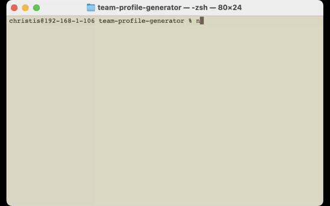
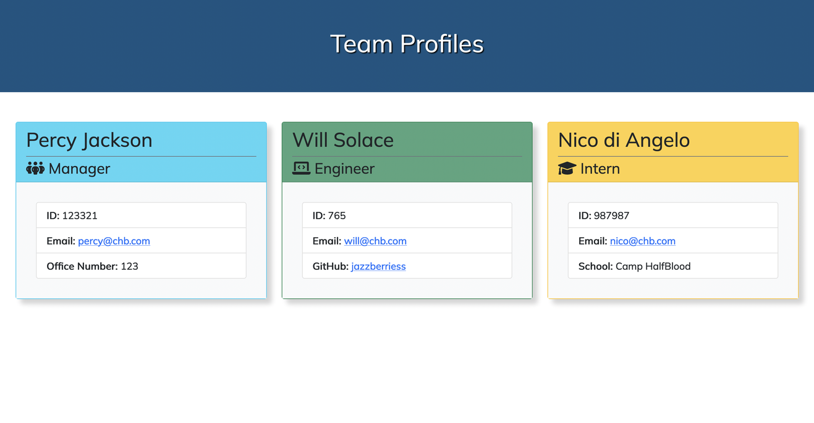

# Team Profile Generator

A node.js powered application that is run from the terminal to dynamically generate a team roster built from the data that the user inputs.

## Table of Contents

* [Technologies](#technologies)
* [Installation](#installation)
* [Usage](#usage)
* [Live Demo](#live-demo)
* [Resources](#resources)
* [License](#license)

## Technologies
This applicaation was built using the following technologies and languages:
* [Node.js](https://nodejs.org/en/)
* [Inquirer](https://www.npmjs.com/package/inquirer)
* [Jest](https://www.npmjs.com/package/jest)
* [Bootstrap](https://getbootstrap.com/)
* HTML
* CSS
* JavaScript

## Installation

To run the Team Profile Generator, you'll first need to clone the [team-profile-generator repo on GitHub](https://github.com/jazzberriess/team-profile-generator) or download the zipfile, then install node.js, the inquirer package and jest if you want to run the tests.

To install the dependencies included in this repo, navigate to the root directory of the cloned or downloaded repo. In either your terminal, command line or using the integrated terminal in your code editor of choice, enter the following command:

`npm i`

OR

`npm install`

## Usage

To use the Team Profile Generator, clone or download the repo and install the dependencies as instructed above.

Next, enter the following command in either your terminal, command line or using the integrated terminal in your code editor of choice:

`node index.js`

Then, answer the prompts.

Once the prompts have been filled, an index.html file will be generated in the dist folder for you to then copy or move to whichever location you prefer.

## Live Demo
### [Video demonstration of the application being used](https://drive.google.com/file/d/1erocu6cCTiuupMLNhHFyFsF_9L4VjEbL/view) in the integrated terminal in VS Code.

The index.html file that was generated during this video can be found by viewing the [index.html file](https://github.com/jazzberriess/team-profile-generator/blob/main/dist/index.html).

### Demonstration gif of the application passing written tests from the terminal:

### Demonstration gif of the application prompts being answered:

### Demonstration gif of the generated index.html file:

### Screenshot of the rendered index.html page:

## Resources
* [Jest Documentation](https://jestjs.io/docs/getting-started)
* [Inquirer Documentation](https://github.com/SBoudrias/Inquirer.js#readme)
* [MDN Docs - JavaScript](https://developer.mozilla.org/en-US/docs/Web/JavaScript/Reference)
* [Bootstrap Documentation](https://getbootstrap.com/docs/5.1/getting-started/introduction/)
* [CSS Tricks - Template Literals](https://css-tricks.com/template-literals/)
* [JavaScript Tutorial - Template Literals in Depth](https://www.javascripttutorial.net/es6/javascript-template-literals/)
* [StackOverflow - Loop through an array containing objects](https://stackoverflow.com/questions/16626735/how-to-loop-through-an-array-containing-objects-and-access-their-properties)
* [Stack Overflow - How can I validate an E-mail address in JavaScript](https://stackoverflow.com/questions/46155/how-can-i-validate-an-email-address-in-javascript)
* [How to use Inquirer.js](https://javascript.plainenglish.io/how-to-inquirer-js-c10a4e05ef1f)
* [Use Inquirer.js to Create a Conversational CLI User Interface](https://pakstech.com/blog/inquirer-js/)
* [Email Regex](https://emailregex.com/)
* [Google Fonts](https://fonts.google.com/)
* [Font Awesome](https://fontawesome.com/)

## License

This project is covered under the [MIT license](https://github.com/jazzberriess/prof-readme-generator/blob/main/LICENSE)

&copy; 2022 Christi Scappatura